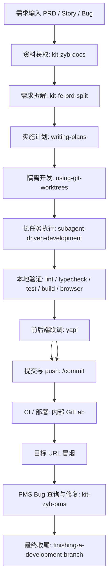
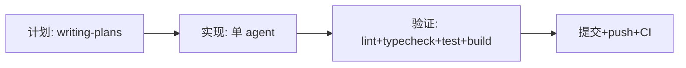

# 前端需求长任务工作流

本文档定义从 PRD 输入到开发、审查、部署、冒烟、PMS Bug 闭环的可执行流程。目标是让一次复杂需求可以被拆成多个可恢复、可并行、可审计的长时间任务。

适用默认技术栈：Vite、TypeScript、Vue 3、ES6、Element Plus。实际命令必须以目标工程的 `package.json` 和 CI 配置为准；编写本文档时，当前仓库根目录没有前端工程脚本，因此不能硬编码 `eslint`、`tsc` 或 `vite` 命令。

硬规则：
- 需求没有拆清楚，不进入开发。
- 没有新鲜验证证据，不声明完成、不提交、不合并、不发布。
- 多 agent 可以并行审阅和调查，但同一 worktree 或同一文件所有权不要并行实现。
- TypeScript 检查不要裸跑 `tsc`；进入实际前端工程目录后，优先用 `bun run <script>` 调用项目脚本，例如 `bun run typecheck`，脚本内部可包装 `vue-tsc`。
- 本地验证命令必须尽量与 CI job 一致；不一致时要记录原因和风险。

## 1. Skill 路由

### 仓库内核心 skill

| 场景 | 使用 skill | 产物 / 退出条件 |
| --- | --- | --- |
| 读取帮帮文档 PRD | `kit-zyb-docs` | 导出 markdown，记录原始 URL、`fileId`、导出时间 |
| 架构概览初始化 | `kit-fe-arc` | 根据项目规范和需求生成或更新 `docs/architecture/overview.md` |
| 复杂 PRD 拆模块 | `kit-fe-prd-split` | `docs/architecture/boundaries.md` 和 `docs/prd/<需求名>/*-需求.md` |
| 查询需求关联 Bug | `kit-zyb-pms` | 需求关联的未关闭 Bug 列表，按 P0-P4 优先级分类统计 |
| 本地分支 / MR / 文件审查 | `cr`（命令 `/cr`） | 审查结论、风险等级、自动修复或人工确认记录 |
| 提交与推送 | `/commit` | 自动生成 commit message、暂存、提交并 push |
| 前后端联调 | `yapi` MCP | 确认接口文档、请求/响应格式匹配，记录联调结果 |

`kit-fe-prd-split` 有前置条件：必须存在 `docs/architecture/overview.md`。如果不存在，先用 `kit-fe-arc` 生成架构概览，不能跳过模块边界分析。增量需求还必须存在 `docs/architecture/boundaries.md`；没有模块地图时，先以全新需求模式生成模块地图。

### Superpowers 开发流程 skill

| 阶段 | 使用 skill | 规则 |
| --- | --- | --- |
| 需求澄清与方案设计 | `brainstorming` | 对新增能力或行为变更先明确目的、约束、验收标准 |
| 写实施计划 | `writing-plans` | 产出 `docs/superpowers/plans/YYYY-MM-DD-<feature>.md`，任务必须有文件、步骤、验证命令 |
| 隔离工作区 | `using-git-worktrees` | 先检测是否已在 worktree，再创建或复用隔离工作区 |
| 独立任务并行调查 | `dispatching-parallel-agents` | 只用于互不共享状态的问题域 |
| 按计划长时间执行 | `subagent-driven-development` | 推荐方式：每个任务新 implementer，之后 spec review 和 code quality review |
| 无 subagent 时执行计划 | `executing-plans` | 串行执行计划，遇到 blocker 立即停下 |
| 请求评审 | `requesting-code-review` | 每个主要任务后、合并前必须评审 |
| 接收评审反馈 | `receiving-code-review` | 对反馈先验证，不盲目照单全收 |
| 系统化排障 | `systematic-debugging` | 遇到 bug、测试失败、CI 失败先定位再改 |
| TDD | `test-driven-development` | 功能和 bugfix 优先红绿循环 |
| 完成分支 | `finishing-a-development-branch` | 全量验证后选择本地合并、创建 MR、保留或丢弃 |
| 完成前验证 | `verification-before-completion` | 任何完成声明前必须跑新鲜验证命令 |

### 浏览器、CI、发布相关 skill

| 场景 | 优先工具 / skill | 说明 |
| --- | --- | --- |
| 本地页面验证 | `Browser`（Codex）或 `Chrome`（Claude Code） | 按当前环境自动选择：检测 `mcp__chrome-devtools__take_snapshot` 可用则用 Chrome，否则用 Browser |
| 内部远程环境 / 需要登录态 | `Chrome` 或 `playwriter` | 需要 SSO、用户 Cookie、已有登录态、远程站点时优先使用 |
| 内部 GitLab / 内部部署 | `/internal-gitlab`、`inf-autodeploy mcp` | 默认 CI/CD 平台；查看 Merge Request、pipeline、job 日志和部署状态 |

## 2. 总流程



每个阶段都必须记录输入、输出、负责人、退出条件和失败处理。建议把记录写到 `docs/tasks/<需求ID或名称>/status.md`，让任务可中断、可恢复。

### 路径分流

根据需求规模选择执行路径，人工在需求准入阶段判定：

| 判定维度 | 快速路径 | 完整路径 |
| --- | --- | --- |
| 变更文件数 | ≤ 10 个文件 | > 10 个文件或涉及多模块 |
| 涉及模块数 | 单模块 | 2+ 模块 |
| 需求类型 | bugfix / hotfix / chore / 小功能 | feat / 重构 / 多人协作 |
| 预估 agent 数 | 1 个 | 2+ 个 |

#### 快速路径（4 步）



跳过：多 agent 并行、worktree 隔离、spec/quality 分层审查、独立冒烟阶段。单 agent 直接在当前分支开发，用 `cr`（命令 `/cr`）做一轮审查即可。

#### 完整路径（13 步）

即上方主流程，适用于多模块、多 agent 并行的复杂需求。

## 3. 长时间任务执行方案

### 3.1 状态文件

每个长任务创建一个状态文件：

```markdown
# <需求名> 状态

**需求 ID:** <PMS Story ID>
**PRD:** <帮帮文档 URL / fileId>
**主分支:** <main / master / release/...>
**集成分支:** <type>/<feature>
**Base SHA:** <git rev-parse HEAD>
**当前阶段:** <阶段名>
**最后一次通过验证:** <命令 + 时间 + 摘要>
**阻断项:** <无 / 列表>

## 任务状态

| 任务 | Agent / Owner | Worktree | 文件所有权 | 状态 | 最新提交 | 验证证据 |
| --- | --- | --- | --- | --- | --- | --- |
| 模块 A | implementer-a | .worktrees/a | src/a/** | TODO | - | - |

## 决策记录

| 时间 | 决策 | 原因 | 影响 |
| --- | --- | --- | --- |
```

状态枚举：
- `TODO`：未开始。
- `IN_PROGRESS`：正在开发。
- `DONE_WITH_CONCERNS`：已完成但 agent 标记风险，必须先处理关注点。
- `NEEDS_CONTEXT`：缺上下文，补充后重新派发。
- `BLOCKED`：无法推进，需要拆任务、升级模型或人工决策。
- `REVIEWING`：处于 spec review 或 code quality review。
- `VERIFIED`：验证和评审均通过。

恢复任务时先读状态文件，再执行：

```bash
git status --short
git branch --show-current
git log --oneline -10
```

然后查看最后一次通过验证和当前阻断项。不要让同一个 agent 在没有新增上下文或策略变化的情况下重复尝试。

### 3.2 长任务阶段门禁

| 阶段 | 进入条件 | 必做动作 | 退出条件 | 失败处理 |
| --- | --- | --- | --- | --- |
| 需求准入 | 有 PRD / Story / Bug 来源 | 用 `kit-zyb-docs` 导出 PRD，记录需求 ID 和验收标准 | 输入资料可追溯 | 缺访问权限则停下让用户登录或授权 |
| 需求拆解 | 有 PRD 和架构概览 | 用 `kit-fe-prd-split` 拆模块、契约、公共能力 | 产出模块地图和子 PRD | 缺 `docs/architecture/overview.md` 则先补架构概览 |
| 计划固化 | 模块边界清楚 | 用 `writing-plans` 写任务计划和验证命令 | 每个任务 2-5 分钟粒度，有明确文件和测试 | 计划有歧义则先修计划，不进入实现 |
| 工作区准备 | 计划已批准 | 用 `using-git-worktrees` 检测或创建 worktree | 记录 worktree、分支、base sha、baseline 验证 | baseline 失败先确认是历史问题还是当前任务阻断 |
| 任务执行 | worktree 可用 | 用 `subagent-driven-development` 派发任务 | 每个任务通过实现、自测、spec review、quality review | `BLOCKED` 时补上下文、拆任务、升级模型或人工决策 |
| 集成验证 | 子任务均 `VERIFIED` | 串行合并 / rebase，跑全量验证 | 本地全量验证通过 | 失败则用 `systematic-debugging` 定位，不可带病提交 |
| 前后端联调 | 本地验证通过 | 用 `yapi` MCP 查接口文档，确认请求/响应格式与代码匹配 | 接口字段、类型、状态码与文档一致 | 接口不匹配则修改代码或联系后端更新文档 |
| 审查提交 | 联调通过 | 用 `cr`（命令 `/cr`）审查，再用 `/commit` 提交并 push | 审查问题关闭，提交范围明确 | 高风险变更需人工确认 |
| CI / 部署 | 已 push 或 MR 创建 | 查看 GitLab pipeline，部署到目标环境，记录 commit SHA | CI 全绿，部署环境 commit 匹配 | CI 失败走日志定位，部署失败停下 |
| 冒烟 / PMS | 部署完成 | 用 Browser/Chrome 冒烟，用 `kit-zyb-pms` 查 Bug | 核心路径通过，P0-P2 无阻断 | 修 Bug 后回到本地验证和提交流程 |
| 收尾 | 发布闭环完成 | 用 `finishing-a-development-branch` 选择合并、MR 或保留 | 分支、MR、worktree 状态清楚 | 丢弃必须明确确认 |

## 4. 多 agent 交叉评审机制

### 4.1 角色分工

| 角色 | 职责 | 禁止事项 |
| --- | --- | --- |
| Controller | 拆任务、裁剪上下文、分配 worktree、合并结果、最终判断 | 不把自己的实现当作最终评审 |
| Implementer | 按单个任务实现、测试、提交小步变更 | 不跨文件所有权改其他模块 |
| Debug Agent | 对独立失败域做系统化排障 | 不在未定位前直接改代码 |

所有审查统一用 `cr`（命令 `/cr`）：每个 Implementer 完成后由 Controller 用 `cr` 审查，多模块合并后再用 `cr` 做集成审查。

### 4.2 并行原则

可以并行：
- 不同业务模块，且文件所有权不重叠。
- 不同测试失败域，且根因互不依赖。
- 文档审查、风险审查、测试命令发现等只读任务。

不能并行：
- 同一个文件集合的实现。
- 同一个公共 API 的不同方向修改。
- 数据结构 / 路由 / store / 构建配置等共享契约未稳定时的多方改动。
- 多个 worktree 同时 merge 到集成分支。

任务分配前必须维护文件所有权矩阵：

| 模块 / 任务 | Worktree | Owner | 允许修改 | 禁止修改 | 集成顺序 |
| --- | --- | --- | --- | --- | --- |
| 示例模块 | `.worktrees/example` | agent-a | `src/modules/example/**` | `src/shared/**` 未经确认不可改 | 1 |

## 5. Worktree、分支与合并策略

### 5.1 创建前检测

执行计划前先检测是否已经在隔离 worktree：

```bash
GIT_DIR=$(cd "$(git rev-parse --git-dir)" 2>/dev/null && pwd -P)
GIT_COMMON=$(cd "$(git rev-parse --git-common-dir)" 2>/dev/null && pwd -P)
git rev-parse --show-superproject-working-tree 2>/dev/null
git branch --show-current
git status --short
```

判定规则：如果 `GIT_DIR != GIT_COMMON` 且不在 submodule 中，说明已经处于 linked worktree，不要再嵌套创建 worktree。

如果使用项目内 `.worktrees/`，必须确认该目录被 ignore；否则先补 `.gitignore` 并提交。

```bash
git check-ignore -q .worktrees || git check-ignore -q worktrees
```

### 5.2 命名约定

默认分支命名：`<type>/<name>`。

常用 `type`：
- `feat`：新功能或需求开发。
- `bugfix`：普通缺陷修复。
- `hotfix`：线上紧急修复。
- `refactor`：不改变行为的重构。
- `docs`：文档变更。
- `chore`：工程化、配置、依赖、脚本等杂项。

如团队已有更细分类，可沿用同一形态：`<type>/<需求名或问题摘要>`。

建议：
- 集成分支：`feat/<需求名>`、`bugfix/<缺陷名>` 或 `hotfix/<线上问题>`。
- 模块分支：`feat/<需求名>-<模块名>` 或 `bugfix/<缺陷名>-<模块名>`。
- Worktree 路径：`.worktrees/<需求名>-<模块名>`。

### 5.3 分支创建门禁

创建分支前必须先确定 `type` 和 `name`，并校验最终分支名符合 `<type>/<name>`。`name` 建议使用需求 ID、Bug ID 或英文 kebab-case 摘要，避免空格和特殊字符。

允许的默认 `type`：`feat`、`bugfix`、`hotfix`、`refactor`、`docs`、`chore`。如团队使用其他类型，必须仍保持 `<type>/<name>` 形态。

普通分支创建：

```bash
TYPE=feat
NAME=<story-id-or-kebab-summary>
BRANCH="${TYPE}/${NAME}"

case "$BRANCH" in
  feat/*|bugfix/*|hotfix/*|refactor/*|docs/*|chore/*) ;;
  *) echo "Invalid branch name: $BRANCH"; exit 1 ;;
esac

git switch -c "$BRANCH"
```

Worktree 分支创建：

```bash
TYPE=feat
NAME=<story-id-or-kebab-summary>
BRANCH="${TYPE}/${NAME}"
WORKTREE_PATH=".worktrees/${NAME}"

case "$BRANCH" in
  feat/*|bugfix/*|hotfix/*|refactor/*|docs/*|chore/*) ;;
  *) echo "Invalid branch name: $BRANCH"; exit 1 ;;
esac

git worktree add "$WORKTREE_PATH" -b "$BRANCH"
```

创建后必须确认：

```bash
git branch --show-current
```

如果当前分支不符合 `<type>/<name>`，不能进入开发、push 或创建 MR。

每个 worktree 记录：
- `base branch`
- `base sha`
- `worktree path`
- `owner`
- `allowed files`
- `baseline verification`

### 5.4 合并与清理

合并规则：
- 由集成 owner 串行合并，不允许多个 agent 同时合并。
- 合并前更新 base，检查冲突风险。
- 每合并一个模块跑相关最小验证；全部合并后跑全量验证。
- 冲突解决后必须重新跑受影响验证，不能复用冲突前结果。

清理规则：
- 只有本地 merge 成功，或明确选择 discard 并确认后，才删除 worktree。
- 如果创建了 MR，保留 worktree 供返修。
- 不要删除外部 harness 管理的 worktree。

## 6. 本地验证与 CI 对齐

### 6.1 命令发现

进入实际前端工程目录后先发现脚本：

```bash
pwd
ls
test -f package.json && bun pm pkg get scripts
test -f package.json && cat package.json
find . -maxdepth 4 -type f \( \
  -name '.gitlab-ci.yml' -o \
  -name 'vite.config.*' -o \
  -name 'tsconfig*.json' -o \
  -name 'eslint.config.*' \
\)
```

如果工程使用 Bun，优先用：

```bash
bun install
bun run lint
bun run typecheck
bun run test
bun run build
```

如果脚本名不同，以 `package.json` 为准。没有脚本时，不能臆造命令；应记录“未发现脚本”，并补充项目约定或向负责人确认。

### 6.2 本地验证矩阵

| 验证项 | 命令来源 | 推荐命令形态 | 通过标准 |
| --- | --- | --- | --- |
| 依赖安装 | 锁文件 / CI | `bun install --frozen-lockfile` 或项目等价命令 | 无错误退出 |
| Lint | `package.json scripts` | `bun run lint` | 0 error |
| Typecheck | `package.json scripts` | `bun run typecheck` | 0 error；不要裸跑 `tsc` |
| Unit / Component Test | `package.json scripts` | `bun run test` | 0 failed |
| Build | `package.json scripts` | `bun run build` | 构建成功，产物生成 |
| Preview / Smoke | Vite / 项目脚本 | `bun run preview` 或项目等价命令 | 核心页面可访问，无阻断错误 |

### 6.3 完成声明门禁

任何“完成”“通过”“已修复”“可以发布”的表述之前，必须有本轮新鲜验证证据：

```bash
git status --short
bun run lint
bun run typecheck
bun run test
bun run build
```

实际命令按工程脚本替换。若只跑了部分验证，结论只能说“已通过 X，Y 未验证”，不能扩大结论。

## 7. 审查、提交与 Push

提交前流程：

1. 用 `git status --short` 和 `git diff` 确认变更范围。
2. 用 `cr`（命令 `/cr`）审查本地分支、MR、提交或文件。
3. Critical 和 Important 问题必须修复或给出技术反驳；高风险变更需要人工确认。
4. 根据审查意见改代码后，重新跑 `cr` 或记录最终审查的 base/head SHA，确保最终 diff 已审。
5. 重新运行相关验证。
6. 用 `/commit` 提交并 push。禁止直接 push 到 protected `main` / `master` 分支；禁止 `--force`，必须强推时只能人工确认后使用 `--force-with-lease`。
7. 创建或更新 GitLab MR，确认 target branch、reviewer、关联 Story/Bug。
8. 记录远程分支、GitLab MR、pipeline 链接。

不要把审查和提交写成一个不可分割动作。审查通过后再 `/commit`，确保可追溯。

高风险变更包括：
- 公共 API 或数据格式变更。
- 路由、权限、登录态、支付、埋点、实验分流变更。
- 构建配置、部署配置、依赖版本变更。
- 测试基线更新或快照大规模变化。
- 多模块共享状态、store、缓存、全局样式变更。

#### 人工判断节点与自动化规则

以下决策节点中，agent 先按规则自动判断，仅在规则无法覆盖时才停下来请求人工：

| 决策节点 | 自动判断规则 | 必须人工 |
| --- | --- | --- |
| 计划是否可执行 | 检查每个任务是否有文件路径、验证命令、预期输出；缺任意一项自动补全或标记歧义 | 业务逻辑歧义 |
| baseline 失败原因 | 对比 base SHA 快照：若 base 本身已失败则标记"历史问题"并继续；若 base 通过则标记"当前阻断" | 无法自动判断时 |
| 变更是否高风险 | 按上方高风险清单自动检测文件路径和 diff 内容 | — |
| CI 失败根因 | 按日志模式匹配分类：依赖安装失败、lint 错误、类型错误、测试失败、构建失败 | 复杂交互问题 |
| P2 Bug 延期 | 自动标记延期 + 通知 owner，默认允许带风险发布 | P0/P1 不可延期 |
| BLOCKED 处理 | 自动尝试：补上下文 → 拆任务 → 升级模型；三次失败后停下 | 三次自动尝试均失败 |
| force push | — | 必须人工确认 |
| worktree 丢弃 | — | 必须人工确认 |

## 8. CI / CD 与部署

### 8.1 CI

默认使用内部 GitLab：
- 使用 `/internal-gitlab` skill 查看 Merge Request、pipeline、job、日志。
- 确认 MR 的 source branch、target branch、commit SHA 与本次发布范围一致。
- 记录 MR URL、pipeline URL、失败 job 名称、失败日志摘要和对应 commit SHA。
- 如果 `/internal-gitlab` skill 不可用，记录 GitLab 页面 URL 和人工检查结果。
- 修复 CI 失败前先总结根因和修复计划；不要在没有定位日志的情况下改代码。

CI 成功标准：
- 最新 pipeline 必须对应待发布 commit SHA。
- 所有 required job 成功，包括但不限于 lint、typecheck、test、build、e2e、security、deploy gate。
- `manual`、`allow_failure`、`skipped` job 必须记录原因、影响范围和 owner。
- 外部检查失败时要记录 URL 和当前 owner，不能忽略。

建议维护 GitLab job 到本地命令的映射：

| GitLab job | 本地复现命令 | 是否可本地复现 | 差异 / 风险 |
| --- | --- | --- | --- |
| lint | `bun run lint` | 是 | 以项目脚本为准 |
| typecheck | `bun run typecheck` | 是 | 不裸跑 `tsc` |
| test | `bun run test` | 视项目而定 | 需记录依赖服务 |
| build | `bun run build` | 是 | 环境变量需与 CI 对齐 |
| e2e / deploy / security | `<按 CI 配置填写>` | 视项目而定 | 不可本地复现时记录 owner |

### 8.2 部署

部署前记录：
- 目标环境：ship（测试环境）。
- 发布分支和 commit SHA。
- 部署工具：`inf-autodeploy mcp` 或人工平台。
- Deploy task ID / 链接、构建产物或 artifact 版本。
- 配置项和环境变量变更。
- 回滚版本、回滚方案和负责人。

部署后验证：
- 部署任务状态成功。
- 目标环境实际运行 commit 与预期一致。
- 关键静态资源和接口返回正常。
- 有部署链接、日志摘要、task ID、运行版本校验或截图作为证据。

部署失败处理：
- 不进入冒烟。
- 保留失败日志。
- 判断是构建、发布平台、配置还是运行时问题。
- 修复后回到本地验证、审查、提交、CI 流程。

## 9. 冒烟与 PMS Bug 闭环

### 9.1 冒烟

本地 `localhost` 或本地预览页面用 `Browser`。内部远程环境通常依赖 SSO / Cookie，优先用 `Chrome` 或 `playwriter`，并记录账号来源、目标 commit、控制台、关键接口和截图证据。

冒烟记录模板：

| 项 | 内容 |
| --- | --- |
| URL | `<目标地址>` |
| 环境 | `ship` |
| Commit | `<sha>` |
| 账号 / 登录态 | `<账号、SSO 或 Cookie 来源>` |
| 核心路径 | `<页面和操作步骤>` |
| 接口状态 | `<关键接口状态码 / 响应摘要>` |
| 控制台 | `<error 数量和摘要>` |
| 截图 / 证据 | `<路径或链接>` |
| 结论 | `<通过 / 失败 / 部分未验证>` |

至少覆盖：
- 页面可打开，主入口无白屏。
- 关键业务路径可完成。
- 控制台无阻断级 error。
- 关键接口无 4xx / 5xx 或业务错误。
- 视觉和交互没有明显回归。

### 9.2 PMS Bug 闭环

发布前和修复后都用 `kit-zyb-pms` 查询需求关联 Bug。默认查询 `open,handling`。

阻断规则建议：
- P0/P1 未关闭：禁止发布，不允许延期放行。
- P2 未关闭：默认禁止发布；如需延期，必须有明确审批、owner、截止时间和影响说明。
- P3/P4 可带风险发布，但必须记录延期原因和 owner。

修复 Bug 后：
1. 将 Bug ID 写入任务状态文件。
2. 修复代码并跑本地验证。
3. 重新走审查、提交、CI、部署、冒烟。
4. 重新部署并完成目标环境冒烟。
5. 再查 PMS，确认状态已流转到 `resolved` / `closed`。仅 P2-P4 可按阻断规则记录审批后的延期项。

## 10. 最终检查清单

以下为**阻断项**（任一未通过则不能提交/发布），agent 可自动检查：

- [ ] **计划就绪**：PRD 已导出、架构概览存在、实施计划已写入（快速路径可省略拆模块）
- [ ] **分支合规**：分支名符合 `<type>/<name>`，未直接 push 到 protected 分支
- [ ] **本地验证全通过**：lint 0 error、typecheck 0 error、test 0 failed、build 成功
- [ ] **审查通过**：`cr` 审查完成，Critical / Important 问题已关闭
- [ ] **提交范围干净**：`git diff --cached` 无无关变更
- [ ] **CI 全绿**：pipeline 对应待发布 commit，required job 均成功
- [ ] **部署验证**：目标环境运行目标 commit，关键资源/接口正常
- [ ] **冒烟通过**：核心路径可完成，控制台无阻断 error，关键接口无 4xx/5xx
- [ ] **PMS 无阻断**：P0/P1 已关闭，P2 无未审批延期
- [ ] **收尾完成**：MR 已创建、worktree 状态清楚、风险和延期项有 owner

### 建议检查（非阻断，但推荐执行）

- `manual`/`allow_failure`/`skipped` job 的原因已记录
- 冒烟截图/证据已保存
- 发布证据包完整（MR、pipeline、deploy task、PMS 查询结果）
- 审查后如有修改，最终 diff 已重新审查

## 11. 推荐执行模板

```markdown
## 本次需求执行记录

1. 资料获取
   - PRD:
   - PMS Story:
   - 导出文件:

2. 拆解产物
   - 模块地图:
   - 子 PRD:
   - 公共能力:

3. 计划
   - Plan:
   - 集成分支:
   - Base SHA:

4. 并行任务
   - 任务 / Worktree / Owner / 文件所有权:

5. 验证证据
   - lint:
   - typecheck:
   - test:
   - build:
   - browser smoke:

6. 审查与提交
   - cr:
   - reviewer:
   - commit:
   - MR:

7. CI / 部署 / PMS
   - CI:
   - deploy:
   - smoke:
   - PMS:

8. 风险和延期
   - 风险:
   - owner:
   - 截止时间:
```
