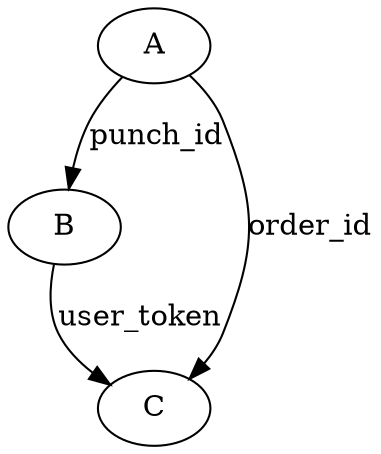

# 业务逻辑拆解官 (Logic Decomposer)

## Overview

将复杂产品需求（PRD）拆解为高内聚、低耦合的业务逻辑模块，根据场景不同输出：
- **全新需求：** 输出《模块拆分与交互地图》
- **增量需求：** 更新《模块拆分与交互地图》+ 输出《子需求细化文档》

## When to Use

- PRD 包含多个页面/功能，需要多人或多个 subagent 并行开发
- 页面间存在复杂跳转和数据依赖，不确定模块边界
- 发现多个模块有重复能力（如都需上传图片、定位），需抽离公共能力
- 新项目启动或大型功能重构前，需全局架构评审
- **增量需求**：现有系统已存在模块地图，需基于已有架构新增功能或变更已有模块

**前置依赖：** 必须先确认《docs/architecture/overview.md》存在（kit-fe-arc skill 产出），若不存在则提示用户先执行 kit-fe-arc。

## Input

- 《docs/architecture/overview.md》文档（母本，必须存在）
- 详细产品需求文档（PRD）或页面列表

## 执行流程

### Step 0: 前置检查

1. 检查 `docs/architecture/overview.md` 是否存在
   - 若不存在 → **阻断**，提示用户：「请先执行 kit-fe-arc skill 生成架构概览文档。」
2. 读取 `docs/architecture/overview.md`，理解项目整体架构

### Step 1: 询问需求类型

**必须主动询问用户：**

```
请确认本次需求类型：
1. 全新需求 — 项目从零开始，还没有模块地图
2. 增量需求 — 在已有项目上新增/变更功能

请回复 1 或 2。
```

根据用户回答进入不同分支：

---

## 分支 A：全新需求

### A-1: 逻辑聚类

将 PRD 页面按业务流向聚类为 3-5 个大模块：

| 聚类原则 | 示例 |
|---------|------|
| 同一用户旅程 | 首页 → 详情 → 成功页 |
| 同一数据域 | 用户、订单、支付 |
| 同一技术栈 | 都需要地图、都需要拍照 |

**产出：** 模块清单（模块A、模块B、模块C...）

### A-2: 边界定义

对每个模块定义：

```markdown
### [模块名称]
**职责范围：** 该模块负责哪些页面和具体功能
**私有状态：** 模块内自用的数据（不共享）
**全局依赖：** 需要从全局 Store 或父模块获取什么数据
```

### A-3: 桥接契约

- **跳转契约：** 模块 A → 模块 B 的跳转路径、必须携带的参数、前置条件
- **数据交接：** A 结束后数据流向（写数据库 / 存全局 Store / 传给 B 模块）
- **规格同步：** 识别重复功能点，强制抽离为公共能力（图片上传、定位服务、埋点上报、登录态校验等）

### A-4: 生成模块地图

输出完整的《模块拆分与交互地图》，写入 `docs/architecture/boundaries.md`，格式见下方 Output Format。

### A-5: 确认需求名称与目录

询问用户本次需求的名称（用于创建子需求目录）：

```
请提供本次需求的名称（将用于创建目录 docs/prd/[需求名]/）：
```

收到需求名称后，检查 `docs/prd/[需求名]/` 是否已存在：
- **已存在** → 提示用户：「目录 docs/prd/[需求名]/ 已存在，是否继续使用该目录？还是更换一个名称？」
- **不存在** → 创建目录，继续

### A-6: 生成子需求文档

在 `docs/prd/[需求名]/` 目录下，为每个模块生成独立的子需求细化文档：

```
docs/prd/[需求名]/
    ├── [模块A]-需求.md
    ├── [模块B]-需求.md
    └── ...
```

文档格式见下方 Sub-PRD Template。

### A-7: 执行确认

```
交付物检查：
- [x] 模块拆分与交互地图 → docs/architecture/boundaries.md
- [ ] docs/prd/[需求名]/模块A-需求.md
- [ ] docs/prd/[需求名]/模块B-需求.md
- [ ] ...

是否需要调整？
```

---

## 分支 B：增量需求

### B-1: 检查模块地图

检查 `docs/architecture/boundaries.md` 是否存在：

- **不存在** → **阻断**，提示用户：「当前项目没有模块地图（docs/architecture/boundaries.md），请先以"全新需求"模式执行本 skill 生成模块地图，或手动补充后再继续。」
- **存在** → 读取并分析已有模块、跳转契约和数据依赖，继续下一步

### B-2: 确认需求名称与目录

询问用户本次需求的名称（用于创建子需求目录）：

```
请提供本次需求的名称（将用于创建目录 docs/prd/[需求名]/）：
```

收到需求名称后，检查 `docs/prd/[需求名]/` 是否已存在：
- **已存在** → 提示用户：「目录 docs/prd/[需求名]/ 已存在，是否继续使用该目录？还是更换一个名称？」
- **不存在** → 创建目录，继续

### B-3: Diff 分析

对比新需求与现有模块地图，确定变更范围：

1. 哪些是**新增模块**（现有地图中找不到对应模块）
2. 哪些是**变更模块**（涉及已有模块的功能修改）
3. 哪些模块**不受影响**

### B-4: 逻辑聚类与边界定义

对新增/变更部分执行与全新需求相同的聚类、边界定义、桥接契约分析（参考 A-1 ~ A-3）。

### B-5: 更新模块地图

**直接修改** `docs/architecture/boundaries.md`：
- 新增模块用 `【新增】` 标注
- 变更模块用 `【变更】` 标注，附变更说明
- 未变动的模块保持原样
- 更新跳转交互图（如有新的模块间跳转）

### B-6: 生成子需求文档

在 `docs/prd/[需求名]/` 目录下，为每个新增/变更模块生成独立的子需求细化文档：

```
docs/prd/[需求名]/
    ├── [模块A]-需求.md
    ├── [模块B]-需求.md
    └── ...
```

文档格式见下方 Sub-PRD Template。

> **注意：** 只为本次涉及的新增/变更模块生成子需求文档，不影响的模块不需要生成。

### B-7: 执行确认

```
交付物检查：
- [x] 模块地图已更新 → docs/architecture/boundaries.md
    - 【新增】模块: module-X
    - 【变更】模块: module-Y（变更说明：...）
- [ ] docs/prd/[需求名]/module-X-需求.md（新增模块）
- [ ] docs/prd/[需求名]/module-Y-需求.md（变更模块）

变更影响分析：
- 受影响的已有跳转：模块A → 模块B（新增参数 XXX）
- 无影响的模块：模块C、模块D（无需回归）

是否需要调整？
```

---

## Output Format

### 模块拆分与交互地图

```markdown
# 模块拆分与交互地图

## 模块概览
| 模块名 | 包含页面 | 核心职责 |
|--------|---------|---------|
| 模块A | 页面1, 页面2 | ... |

---

## [模块名称]

### 基本信息
**包含页面：** ...
**核心逻辑说明：** ...

### 边界定义
| 类型 | 内容 |
|------|------|
| 职责范围 | ... |
| 私有状态 | ... |
| 全局依赖 | ... |

### 输入/输出契约
**进入：** 如何进入该模块（初始参数）
**离开：** 如何离开该模块（跳转目标、携带参数）

### 关联风险点
- 风险1：B 模块依赖 A 模块生成的 XXX ID
- 风险2：...

---

## 公共能力抽离

| 能力 | 使用模块 | 实现方式 |
|------|---------|---------|
| 图片上传 | A, B, C | 抽离为 composable |
| 定位服务 | A, D | 抽离为公共 service |

---

## 跳转交互图


```

### 子需求细化文档模板

```markdown
# [模块名称] 子需求细化文档

> **所属模块：** 模块A
> **所属需求：** [需求名]
> **生成日期：** YYYY-MM-DD

## 契约声明

### Input（该模块必须接收的参数）
| 参数名 | 类型 | 来源 | 说明 |
|--------|------|------|------|
| token | string | authStore | 登录态 Token |
| subject | string | router.params | 学科（math/chinese/english） |
| grade | number | 用户选择 | 年级（2-6） |

### Output（该模块必须产出的结果）
| 结果 | 类型 | 目标 |
|------|------|------|
| report_id | string | 跳转 Report 模块 |
| has_equity | boolean | 更新 authStore |

---

## 页面详情（从 PRD 提取）

### 3.X.X 页面名称

#### 功能概述
...

#### 前置条件
...

#### 操作步骤
...

#### 预期结果
...

#### 异常情况与错误处理
...

#### 业务规则与数据约束
...

---

## 引用《/doc/overview.md》

### 公共 Hooks
| Hook | 用途 |
|------|------|
| useAuth | 登录态校验 |
| useToast | 轻提示 |

### 公共组件
| 组件 | 用途 |
|------|------|
| AppButton | 统一按钮 |
| AppModal | 弹窗 |

### 全局 Store
| Store | 状态 |
|-------|------|
| authStore | token, userInfo, hasEquity |
| assessmentStore | answers, progress |
```

## Quick Reference

| 产物 | 位置 |
|------|------|
| 输入：架构概览 | `docs/architecture/overview.md` |
| 输入：模块地图（增量时） | `docs/architecture/boundaries.md` |
| 输出：模块地图 | `docs/architecture/boundaries.md` |
| 输出：子需求文档（增量时） | `docs/prd/[需求名]/[模块名]-需求.md` |

## Common Mistakes

| 错误 | 正确做法 |
|------|---------|
| 不询问用户直接判断需求类型 | 必须先主动询问用户是全新还是增量 |
| 增量需求没有模块地图却继续执行 | 必须阻断，提示用户先生成模块地图 |
| 增量需求生成独立的增量版文件 | 直接修改原始 `boundaries.md`，用标注区分 |
| 子需求文档散落在 sub_prd 根目录 | 必须按需求名建子目录 `docs/prd/[需求名]/` |
| 需求目录名重复时直接覆盖 | 必须提示用户确认或更换名称 |
| 全新需求不生成子需求文档 | 全新需求也必须按需求名建目录并生成子需求文档 |
| 模块数超过 5 个 | 再聚类，合并低内聚模块 |
| 跳过 docs/architecture/overview.md | 必须先确认架构概览存在 |
| 契约定义不具体 | 必须写明参数名称和类型 |
| 遗漏跳转风险 | 关联风险点必须标注依赖 ID |
| 变更需求未做影响分析 | 必须说明变更对已有跳转契约和模块的潜在影响 |
