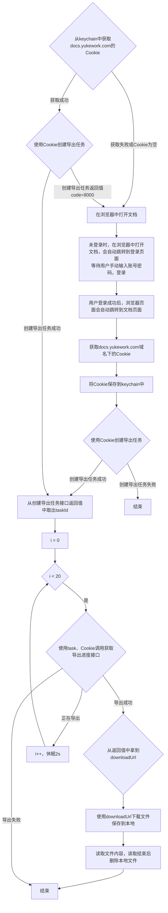

# 帮帮文档获取工作流程

## 流程图

## 详细步骤说明

### 步骤1: Cookie获取
**目标**: 从系统keychain获取已保存的Cookie
- **成功**: 进入步骤2
- **失败**: 进入步骤3

### 步骤2: 创建导出任务（使用现有Cookie）
**目标**: 使用获取到的Cookie创建文档导出任务
- **成功 (code=0)**: 获取taskId，进入步骤5
- **失败 (code=8000)**: Cookie无效，进入步骤3
- **其他失败**: 结束流程

### 步骤3: 浏览器打开文档
**目标**: 在默认浏览器中打开文档链接
- 如果用户未登录，会自动跳转到登录页面
- 等待用户手动输入账号密码登录

### 步骤4: 用户登录和Cookie获取
**目标**: 用户登录后获取新的Cookie
1. 用户登录成功后，页面自动跳转到文档页面
2. 从浏览器获取docs.yukework.com域名下的Cookie
3. 将Cookie保存到系统keychain中
4. 使用新Cookie创建导出任务

### 步骤5: 导出任务轮询
**目标**: 监控导出任务进度
- **初始化**: i = 0
- **循环条件**: i < 20（最多尝试20次）
- **轮询间隔**: 2秒
- **状态判断**:
  - 导出成功: 获取downloadUrl，进入步骤6
  - 正在导出: i++，休眠2秒，继续轮询
  - 导出失败: 结束流程

### 步骤6: 文件下载和内容提取
**目标**: 下载导出的文档并提取内容
1. 使用downloadUrl下载文件到本地临时目录
2. 读取文件内容
3. 读取完成后删除本地文件
4. 返回提取的内容

## 关键决策点

### 决策点1: Cookie有效性检查
- **检查时机**: 创建导出任务时
- **判断标准**: 接口返回code=8000
- **处理方式**: 重新引导用户登录

### 决策点2: 导出任务状态判断
- **成功**: taskStatus=1
- **进行中**: taskStatus=0
- **失败**: taskStatus=2 或 code!=0

### 决策点3: 轮询终止条件
- **成功**: 获取到downloadUrl
- **失败**: 导出失败或达到最大重试次数(20次)
- **超时**: 总等待时间超过40秒(20×2秒)

## 异常处理流程

### 异常1: Cookie获取失败
- **原因**: keychain中没有保存Cookie
- **处理**: 直接进入浏览器登录流程

### 异常2: 网络连接失败
- **原因**: 网络问题导致API调用失败
- **处理**: 重试机制，最多重试3次

### 异常3: 权限不足
- **原因**: 用户没有文档访问权限
- **处理**: 提示用户检查文档权限

### 异常4: 导出任务超时
- **原因**: 文档过大或服务器处理慢
- **处理**: 增加轮询次数或提示用户稍后重试

## 性能优化建议

### 1. Cookie缓存
- 将有效的Cookie缓存到内存中
- 设置合理的缓存过期时间
- 定期检查Cookie有效性

### 2. 并发控制
- 限制同时进行的导出任务数量
- 使用队列管理任务请求
- 避免对服务器造成过大压力

### 3. 断点续传
- 对于大文件下载，支持断点续传
- 保存下载进度，支持重新开始

### 4. 批量处理
- 支持批量文档处理
- 优化请求顺序，减少等待时间
- 并行处理独立任务

## 监控指标

### 关键指标
1. **Cookie获取成功率**
2. **导出任务创建成功率**
3. **平均导出时间**
4. **文件下载成功率**
5. **用户登录成功率**

### 监控建议
1. 记录每个步骤的执行时间
2. 统计各种错误的发生频率
3. 监控API响应时间变化
4. 跟踪用户登录体验

## 用户体验考虑

### 1. 登录引导
- 清晰的登录提示
- 自动跳转到登录页面
- 登录成功后的自动重定向

### 2. 进度反馈
- 显示导出任务状态
- 提供预计等待时间
- 实时更新进度信息

### 3. 错误提示
- 友好的错误消息
- 具体的解决建议
- 快速重试选项

### 4. 结果展示
- 格式化的内容显示
- 支持多种导出格式
- 提供下载选项
